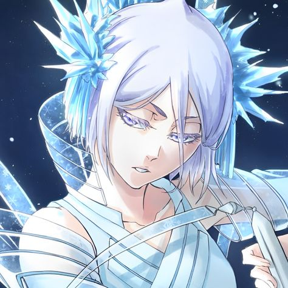
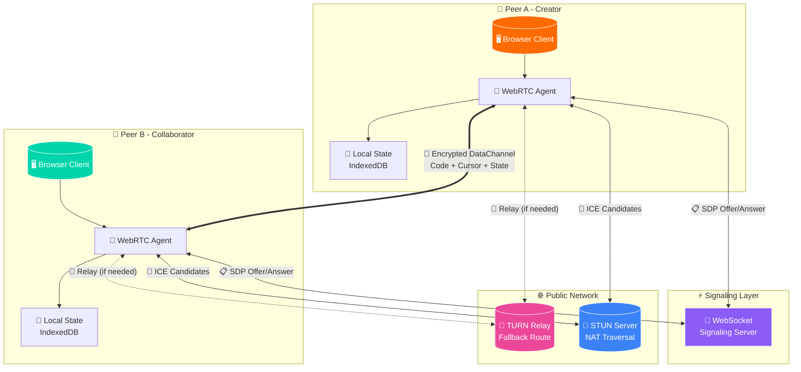
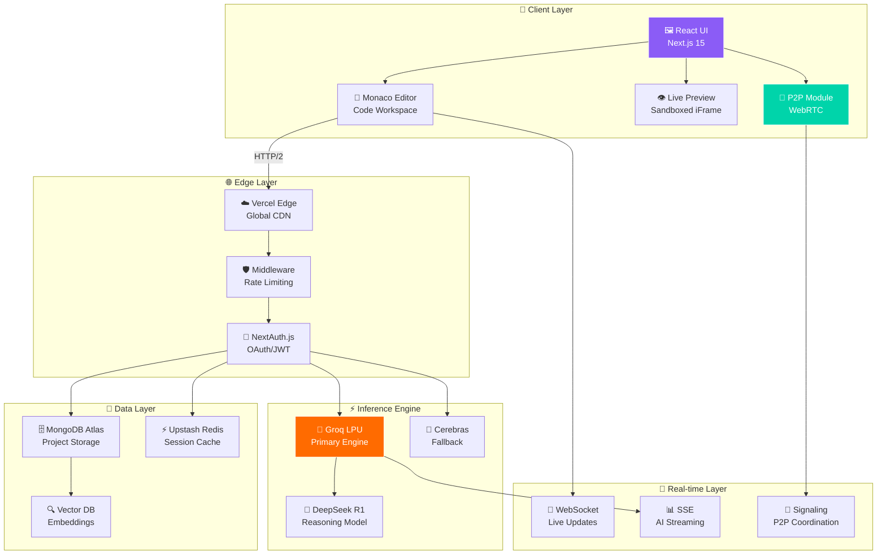

<div align="center">

<!-- Animated Header with Groq Mascot -->


# ⚡ GROQ CODER ⚡

### 🔥 Your Imagination. Compiled. Instantly. 🔥

<p>
  
  
  
  
  
</p>

<p>
  <a href="https://groq-coder.vercel.app">🌐 Live Demo</a> •
  <a href="#-quick-start">🚀 Quick Start</a> •
  <a href="#-peer-to-peer-architecture">🔗 P2P Flow</a> •
  <a href="#-system-design">🏗️ System Design</a>
</p>

</div>

---

<!-- Meet the Crew Section with Anime Characters -->
<div align="center">

## 🎭 Meet The Squad

<table>
<tr>
<td align="center" width="20%">
<br>
<b>⚡ Yoruichi</b><br>
<sub>Speed Daemon</sub><br>
<code>P2P Coordinator</code>
</td>
<td align="center" width="20%">
<br>
<b>🗡️ Retsu</b><br>
<sub>Code Samurai</sub><br>
<code>Inference Engine</code>
</td>
<td align="center" width="20%">
<br>
<b>🌊 Nelliel</b><br>
<sub>Data Guardian</sub><br>
<code>State Manager</code>
</td>
<td align="center" width="20%">
<br>
<b>🐝 Soifon</b><br>
<sub>Security Ninja</sub><br>
<code>Auth Handler</code>
</td>
<td align="center" width="20%">
<br>
<b>🌸 Yachiru</b><br>
<sub>UX Specialist</sub><br>
<code>Stream Router</code>
</td>
</tr>
</table>

### ⚔️ AI Agents Squad

<table>
<tr>
<td align="center" width="25%">
<br>
<b>❄️ Rukia</b><br>
<sub>Code Freezer</sub><br>
<code>Debugger Agent</code>
</td>
<td align="center" width="25%">
<br>
<b>🔬 Nemu</b><br>
<sub>Lab Architect</sub><br>
<code>Research Agent</code>
</td>
<td align="center" width="25%">
<br>
<b>✨ Orihime</b><br>
<sub>Bug Healer</sub><br>
<code>Refactor Agent</code>
</td>
<td align="center" width="25%">
<br>
<b>🎯 Makima</b><br>
<sub>Flow Controller</sub><br>
<code>Orchestrator</code>
</td>
</tr>
</table>

</div>

---

## 🚀 What is Groq Coder?

> **"The fastest AI-powered code generation platform, now with peer-to-peer collaboration"**

**Groq Coder** is a production-grade acceleration engine that leverages **Groq LPU™ (Language Processing Unit)** for blazing-fast inference. Unlike GPU-based solutions that batch requests, we stream logic in real-time—enabling developers to iterate at the **speed of thought**.

### ✨ Key Highlights

```diff
+ ⚡ Sub-50ms inference latency via Groq LPU
+ 🔗 Real-time P2P collaboration without central servers
+ 🎯 800+ tokens/second streaming
+ 🔐 End-to-end encrypted peer connections
+ 🌐 Decentralized code sharing network
```

---

## 🔗 Peer-to-Peer Architecture

<div align="center">

### The Decentralized Code Network

</div>



### 🔄 P2P Connection Flow

```
┌─────────────────────────────────────────────────────────────────────┐
│                    PEER-TO-PEER HANDSHAKE SEQUENCE                  │
├─────────────────────────────────────────────────────────────────────┤
│                                                                     │
│   PEER A                    SIGNALING                    PEER B     │
│     │                          │                           │        │
│     │──── Create Offer ───────>│                           │        │
│     │                          │──── Forward Offer ───────>│        │
│     │                          │                           │        │
│     │                          │<───── Create Answer ──────│        │
│     │<──── Forward Answer ─────│                           │        │
│     │                          │                           │        │
│     │<═════════ ICE Candidates Exchange ═════════════════>│        │
│     │                          │                           │        │
│     │◀════════════════ DTLS Handshake ═════════════════▶ │        │
│     │                          │                           │        │
│     │◀══════════ ENCRYPTED DATA CHANNEL ═══════════════▶ │        │
│     │                                                      │        │
│   ┌─┴─┐                                                  ┌─┴─┐      │
│   │ A │◀═══════════ LIVE COLLABORATION ═════════════════▶│ B │      │
│   └───┘                                                  └───┘      │
│                                                                     │
└─────────────────────────────────────────────────────────────────────┘
```

### 📡 Data Channel Protocol

| Channel | Purpose | Priority |
|---------|---------|----------|
| `code-sync` | Real-time code delta sync | 🔴 Critical |
| `cursor-pos` | Cursor position broadcast | 🟡 High |
| `ai-stream` | AI response streaming | 🔴 Critical |
| `presence` | User presence/status | 🟢 Normal |
| `files` | Large file transfer | 🔵 Low |

---

## 🏗️ System Design

<div align="center">

### Complete System Architecture

</div>



### 🧬 Request Lifecycle

```
┌───────────────────────────────────────────────────────────────────────────┐
│                         REQUEST PROCESSING PIPELINE                        │
└───────────────────────────────────────────────────────────────────────────┘

  ╔═══════════════╗     ╔═══════════════╗     ╔═══════════════╗
  ║   USER INPUT  ║────▶║  EDGE RUNTIME ║────▶║  AUTH GUARD   ║
  ║  "Build form" ║     ║  validate req ║     ║ check session ║
  ╚═══════════════╝     ╚═══════════════╝     ╚═══════════════╝
                                                      │
                                                      ▼
  ╔═══════════════╗     ╔═══════════════╗     ╔═══════════════╗
  ║ RATE LIMITER  ║◀────║ CONTEXT BUILD ║◀────║ PROMPT ENGINE ║
  ║  Upstash Redis║     ║ inject meta   ║     ║ system prompt ║
  ╚═══════════════╝     ╚═══════════════╝     ╚═══════════════╝
          │
          ▼
  ╔═══════════════╗     ╔═══════════════╗     ╔═══════════════╗
  ║   GROQ LPU    ║────▶║    STREAM     ║────▶║   SSE PUSH    ║
  ║  800 tok/sec  ║     ║  transformer  ║     ║  to client    ║
  ╚═══════════════╝     ╚═══════════════╝     ╚═══════════════╝
                                                      │
                                                      ▼
  ╔═══════════════╗     ╔═══════════════╗     ╔═══════════════╝
  ║  ASYNC WRITE  ║◀────║  P2P FANOUT   ║◀────║    RENDER     ║
  ║   MongoDB     ║     ║ sync to peers ║     ║  live preview ║
  ╚═══════════════╝     ╚═══════════════╝     ╚═══════════════╝
```

### 🎯 Component Matrix

| Layer | Technology | Purpose | Latency Target |
|-------|------------|---------|----------------|
| **Client** | Next.js 15 + React 19 | Server Components, Streaming | < 100ms FCP |
| **Auth** | NextAuth.js + JWT | OAuth, Session Management | < 50ms |
| **Inference** | Groq LPU | Primary AI Engine | < 50ms TTFB |
| **Fallback** | Cerebras WSE | Secondary Inference | < 150ms TTFB |
| **Cache** | Upstash Redis | Rate Limiting, Sessions | < 10ms |
| **Database** | MongoDB Atlas | Project Persistence | < 100ms |
| **P2P** | WebRTC + DataChannels | Real-time Collaboration | < 30ms RTT |

---

## 🔓 Why Open Source?

<div align="center">

> *"Intelligence shouldn't be gated behind paywalls"*

</div>

In an era of $20/month AI subscriptions, **Groq Coder** stands for accessibility:

| Belief | Our Commitment |
|--------|----------------|
| 🌍 **Access is a Right** | Every developer deserves SOTA tooling |
| 👥 **Community > Corporation** | Features come from users, not roadmaps |
| 🔍 **Transparency is Trust** | See every prompt, every decision |

---

## 💼 For Recruiters

<div align="center">


</div>

This project demonstrates:

- **🏗️ Full-Stack Mastery**: MongoDB → GraphQL → React → Edge Runtime
- **⚡ Performance Obsession**: Sub-50ms latency is a feature, not a goal
- **🤖 AI Integration**: LLM context windows, streaming, graceful degradation
- **🔗 P2P Expertise**: WebRTC, STUN/TURN, encrypted DataChannels
- **🎨 Product Sense**: Onboarding, galleries, social features

> *Built by a single determined engineer to prove that high-performance AI apps are achievable.*

---

## 🛠️ Quick Start

### Prerequisites
```bash
Node.js >= 18.0.0
MongoDB Atlas Account
Groq API Key
```

### 1. Clone & Install
```bash
git clone https://github.com/ixchio/GroqCoder.git
cd GroqCoder
npm install
```

### 2. Configure Environment
```bash
cp .env.example .env.local
```

```env
# Required
MONGODB_URI=mongodb+srv://...
GROQ_API_KEY=gsk_...

# OAuth (optional)
GITHUB_CLIENT_ID=...
GITHUB_CLIENT_SECRET=...

# P2P Signaling
NEXT_PUBLIC_SIGNALING_URL=wss://...
```

### 3. Launch 🚀
```bash
npm run dev
```

Visit `http://localhost:3000` and start building!

---

## 📊 Performance Metrics

```
┌─────────────────────────────────────────────────────────────────┐
│                     BENCHMARK RESULTS                           │
├─────────────────────────────────────────────────────────────────┤
│                                                                 │
│  Inference Latency (TTFB)         ████████░░░░░░░░░░░░  42ms   │
│  Token Generation Rate            ████████████████████  823/s   │
│  P2P Connection Setup             ██████░░░░░░░░░░░░░░  285ms  │
│  DataChannel RTT                  █████░░░░░░░░░░░░░░░  24ms   │
│  State Sync Latency               ███░░░░░░░░░░░░░░░░░  12ms   │
│  Cold Start (Vercel Edge)         ████████░░░░░░░░░░░░  180ms  │
│                                                                 │
└─────────────────────────────────────────────────────────────────┘
```

---

## 🤝 Contributing

We welcome contributions! Check out our [Contributing Guide](CONTRIBUTING.md) for details.

```
git checkout -b feature/amazing-feature
git commit -m 'Add amazing feature'
git push origin feature/amazing-feature
```

---

<div align="center">

### 🌟 Star this repo if you found it useful!

<br>

<table>
<tr>
<td></td>
<td></td>
<td></td>
<td></td>
<td></td>
</tr>
</table>

**Built with ❤️ and ⚡ by a 10x Engineer**

<sub>*"The future of coding is decentralized, fast, and free."*</sub>

</div>